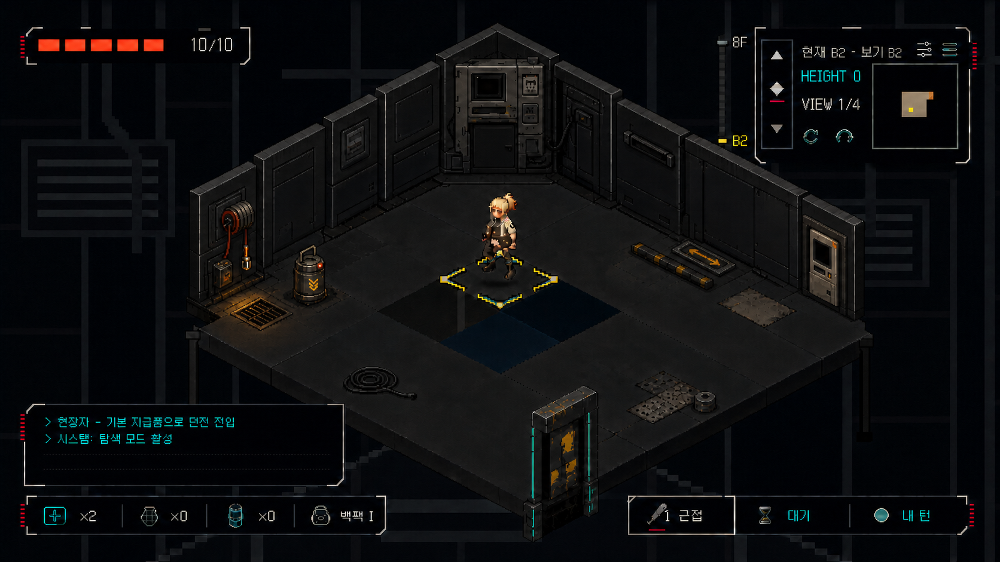
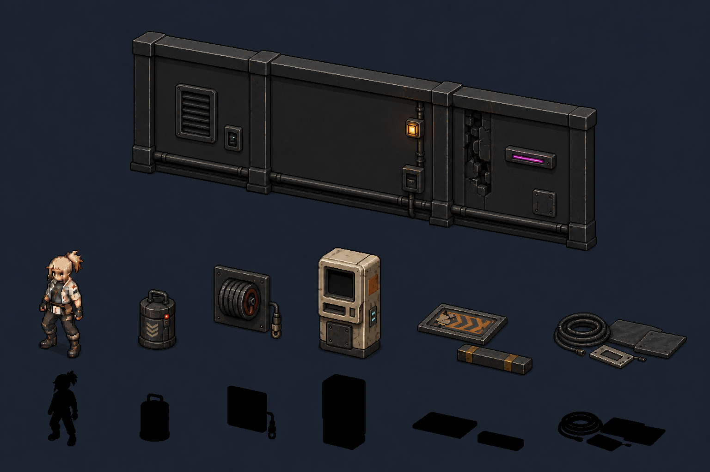

# Project-C 배경 프롭·오브젝트 품질 재설계 제안 v1

> 상태: **B2 수직 슬라이스 적용 / q0~q3 화면 승인**
> 기준일: 2026-08-02
> 범위: B2 시작방 프롭 수직 슬라이스 + 첫 던전 공용 벽 셸
> 결론: 격자·이동 규칙을 유지한 채 에셋 제작 단위와 배치 위계를 실제 런타임에 교체했다.

적용 원화는 `project-c-b2-prop-production-sheet-v2.png`, 재현 프롬프트는 같은 이름의
`.prompt.md`가 소유한다. 원화를 직접 자르지 않고 `process_b2_prop_quality_v4.py`와
`process_b2_parking_dressing_v3.py`로 네이티브 픽셀 자산을 재구성해 Aseprite에 승격했다.
최종 PC 실화면은 `../captures/b2-prop-quality-q{0,1,2,3}-live-v3.png`다.

## 1. 적용 전 진단과 결론

적용 전 화면의 약점은 네온이나 표면 디테일 부족보다 **공간을 만드는 중간 크기 물체가 없고,
서로 다른 게임 규칙을 가진 대상을 같은 방식으로 바닥에 구워 넣은 것**에 가깝다.

- 대표 B2 6×5 방 30칸 중 21칸이 기본 바닥이고, 독립적으로 서 있는 던전 프롭은 폭발통 1개다.
- 범퍼·쓰러진 안내판·배럴 베이는 완성형 바닥 타일에 합성되어 있어 실루엣과 깊이가 작다.
- 벽 캐비닛도 64×112 벽 셀에 구워져 독립된 공간 질량을 만들지 못한다.
- 기존 소품 4종은 구판 627px 셀의 실루엣을 denoise 0.5로 보존한 스타일 변환이다.
  `process_postapoc_props_v2.py`는 이를 BOX 축소·팔레트 잠금·despeckle하지만,
  오래된 모닥불·해골 배럴·이상 게이트·보물상자형 실루엣 자체는 다시 설계하지 못한다.
- `Art/Source/Aseprite`에는 정식 `prop-*.aseprite` 원본이 없었다.
- 기본 벽은 같은 패널이 넓게 반복되고, 원거리 배경은 절차 도형이어서 전경 프롭만 정교하게 만들어도
  전체 화면의 세대 차이가 남는다.

따라서 해법은 작은 잔해를 더 뿌리는 것이 아니라 **큰 건축 덩어리 1개 → 중간 기능 군집 2개 →
낮은 생활 흔적 소수**의 세 단계 위계를 만드는 것이다.

## 2. 채택 화면

이 이미지는 현재 B2의 크기·중앙 직교 동선·HUD 점유를 유지하면서 프롭 위계만 교정한 q0 방향판이다.

- 뒤쪽은 넓고 조용한 벽 패널을 기본으로 두고, 설비 밀도는 좌측 서비스 스파인에 집중한다.
- 좌측은 `벽 호스/소켓 + 이동 가능한 연료 셀 + 배수구` 한 군집이다.
- 우측은 `벽 매립형 결제·티켓 단말 + 낮은 범퍼 + 바닥에 누운 안내판` 한 군집이다.
- 케이블과 철판은 군집에 붙은 낮은 생활 흔적이며, 중앙에는 독립된 장식물을 놓지 않는다.
- 후면의 가짜 틸 통과 화살표를 제거했고, 비상호작용 단말은 바닥 접점이 없는 벽 부착형으로 고쳤다.

이 화면은 **구도·질량·재료 면적·신호색의 기준**이지, 런타임 스프라이트나 지형 변경의 근거가 아니다.
생성 이미지의 HUD·텍스트·바닥 모양을 크롭해 사용하지 않는다.

## 3. 프롭 패밀리 기준

보드는 실루엣과 재료 분업을 승인하는 용도다. 직접 잘라 축소하는 소스 시트는 아니다.

| 화면 역할 | 게임 의미 | 제작 슬롯/방식 |
|---|---|---|
| 조용한 공용 벽 셸 | 비상호작용 건축 | `env-wall-rising-right/left`, 네이티브 64×112 재작화 |
| 서비스 스파인 | 비상호작용 벽 군집 | 방향별 192×176 master를 먼저 완성한 뒤 기존 3×64×112 서비스 벽 슬롯으로 분할 |
| 소형 연료 셀 | 유일한 독립 blocking/interactable 프롭 | 기존 `prop-explosive-barrel`, 128×128 Aseprite로 전면 재작화 |
| 호스 릴·소켓 | 벽 부착 설비 | 서비스 벽 master 또는 `hospitalWallPipes*`; 독립 프롭 금지 |
| 결제·티켓 단말 | 얕은 비상호작용 상업시설 흔적 | `hospitalWallCabinet*`의 벽 일체형 재작화; 바닥 footprint 금지 |
| 쓰러진 안내판 | 통과 가능한 낮은 장식 | 기존 `env-floor-b2-fallen-sign-view-{0..3}` 128×64 완성형 바닥 |
| 주차 범퍼 | 통과 가능한 낮은 장식 | 기존 `env-floor-b2-parking-stop-view-{0..3}` 128×64 완성형 바닥 |
| 케이블·철판 | 선택적 통과 장식 | 새 슬롯을 만들 경우에만 4-view 완전 세트; 첫 수직 슬라이스에서는 보류 가능 |

아이보리 단말을 독립 프롭으로 세우고 싶다면 새 슬롯만 추가해서는 안 된다. 실제 점유·충돌 또는
상호작용 규칙도 함께 추가해야 한다. 이번 패스에서는 벽 매립형으로 고정한다.

## 4. 제작 문법

- 소품을 고해상도 보드에서 BOX 축소하지 않고 최종 128-regime 캔버스에 직접 그린다.
- 낮은 드레싱 8~12색, 일반 프롭 14~20색, 영웅 벽 앵커 최대 24색을 목표로 한다.
- 재료 하나는 큰 명암 3단계로 읽히게 하고, 2×2px 이상 클러스터를 기본 붓으로 삼는다.
- 고립 1px 잡음·안티앨리어싱·부드러운 그라데이션·전면 디더링을 금지한다.
- 물체 면적은 본체 75~85%, 보조 재료 10~20%, 발광/경고 5% 이하로 제한한다.
- 틸은 실제 통과·가동·쿨 상태, 적색은 위험, 앰버는 선택·작업 경고에만 쓴다.
- 읽을 수 있는 간판 글자는 만들지 않고 4×4px 이상의 추상 glyph만 쓴다.
- 넓은 베이크 그림자를 금지하고 발밑 contact AO만 작게 둔다.

## 5. 6×5 방 배치 계약

- 의미 군집은 최대 3개: 후면 벽 앵커 1개, 위험 군집 1개, 반대쪽 진출/상업시설 군집 1개.
- 중앙 직교 이동 spine은 최소 2칸 폭으로 비우고, 플레이어 주변 1칸은 조용하게 둔다.
- 전체 바닥의 40~50%는 시각적으로 비워 둔다.
- 서 있는 프롭의 70% 이상은 벽·모서리·바닥 seam에 붙인다.
- 무릎보다 높거나 바닥 점유가 반 타일보다 큰 대상은 실제 blocking/interactable이어야 한다.
- 통과 가능한 바닥 장식은 발목~낮은 정강이 높이, 얇은 접촉 그림자만 허용한다.
- 가운데 홀로 설 수 있는 대상은 실제 게임플레이 프롭 하나뿐이다.

## 6. 구현 순서와 승인 게이트

1. 공용 기본 벽 `rising-right/left`를 조용한 셸로 네이티브 재작화한다.
2. B2 서비스 벽 3셀 master, 이동 가능한 연료 셀, 낮은 안내판/범퍼, 벽 매립형 단말을 제작한다.
3. Aseprite 원본 → deterministic export → 카탈로그 연결 순서로 승격한다.
4. 같은 세계 좌표와 같은 master에서 q0~q3를 파생해 검증한다. AI가 따로 그린 q1~q3는 위치 근거로 쓰지 않는다.
5. 2560×1440 PC 실화면에서 중앙 spine, HUD 가림, 문 상태, 안내 화살표의 회전,
   프롭 접지와 FOV 가림을 확인한다.
6. 이 수직 슬라이스가 통과한 뒤에만 1F 아케이드 캐비닛 뱅크·셔터 상점 세트로 확장한다.

q0 방향판은 이 게이트를 위한 목표다. 현재는 같은 월드 좌표를 회전한 q1~q3까지 승인했으며,
Aseprite 64개 원본과 카탈로그 64개 슬롯의 연결 검증도 통과했다.

## 7. 적용 후에도 유지한 범위 제한

- 격자 크기, 직교 이동, 충돌, FOV, 층 구조를 시안에 맞춰 변경하지 않는다.
- 작은 잔해 종류를 먼저 늘리지 않는다.
- 시안 PNG를 자르거나 축소해 런타임에 직접 연결하지 않는다.
- 기본 벽과 원거리 배경이 남아 있는 상태에서 모든 층의 프롭을 일괄 생성하지 않는다.
- B2 승격 결과를 근거로 다른 층의 프롭을 자동 일괄 교체하지 않는다.
